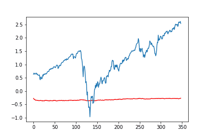
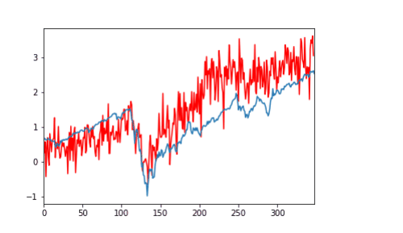

# TransformerSNP500

transformer model 을 사용한 snp 500 예측

data는 snp500 데이터 사용

transformer와 비교를 위한 lstm 사용

snp500, google, amazon 의 주가를 입력값으로 사용, 다음날 하루의 주가 예측

이는 lstm을 사용했을 때의 결과이다.

이는 트랜스포머를 사용했을 때의 결과이다.

각각 11~201 epoch 까지의 결과이며 epoch 단위는 10이다.

한 epoch 당 트랜스포머가 더 시간이 많이 걸린다.

